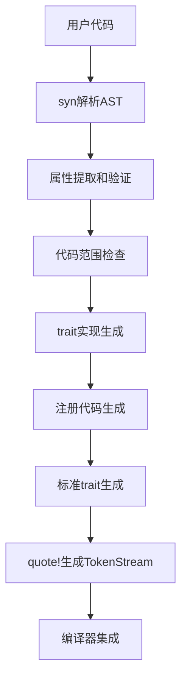
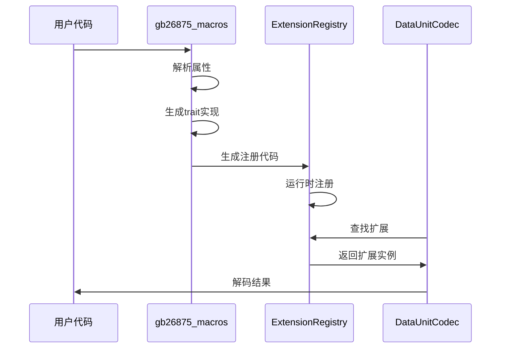

# GB26875 扩展机制实现细节分析

## 概述

GB26875 库的 Phase 4 扩展机制是一个高度复杂但设计精良的系统，允许用户在运行时定义和注册自定义的协议扩展类型（128-255 范围）。该机制通过过程宏、全局注册表、trait 对象和编解码器集成提供了类似 serde 的用户体验。

## 核心架构

### 1. 层次化 Trait 系统

#### 基础 Trait 层

```rust
// 所有扩展类型的基础trait
pub trait ExtensionTrait: fmt::Debug + Send + Sync {
    fn extension_id(&self) -> ExtensionId;
    fn extension_type(&self) -> &'static str;
}

// 扩展数据单元基础trait
pub trait ExtensionDataUnit: fmt::Debug + Send + Sync {
    fn type_id(&self) -> u8;
    fn encode(&self) -> ExtensionResult<Bytes>;
    fn validate(&self) -> ExtensionResult<()>;
    fn as_any(&self) -> &dyn Any;
}
```

#### 专门化 Trait 层

- `CommandExtension`: 用于自定义命令类型（128-255）
- `DataUnitExtension`: 用于自定义数据单元类型（128-254）
- `SystemTypeExtension`: 用于自定义系统类型（128-255）
- `ComponentTypeExtension`: 用于自定义部件类型（128-255）
- `AnalogTypeExtension`: 用于自定义模拟量类型（128-255）

### 2. 全局注册表系统

#### MacroExtensionRegistry

核心组件，管理所有运行时扩展类型：

```rust
pub struct MacroExtensionRegistry {
    command_extensions: RwLock<HashMap<u8, Box<dyn CommandExtension>>>,
    data_unit_extensions: RwLock<HashMap<u8, Box<dyn DataUnitExtension>>>,
    system_type_extensions: RwLock<HashMap<u8, Box<dyn SystemTypeExtension>>>,
    component_type_extensions: RwLock<HashMap<u8, Box<dyn ComponentTypeExtension>>>,
    analog_type_extensions: RwLock<HashMap<u8, Box<dyn AnalogTypeExtension>>>,
    extension_id_registry: RwLock<HashMap<ExtensionId, u8>>,
}
```

**关键特性：**

- 线程安全：使用 RwLock 保护所有映射表
- 类型分离：每种扩展类型有独立的注册表
- ID 管理：ExtensionId 包含模块路径、类型名称和版本信息
- 冲突检测：自动检测和解决扩展 ID 冲突

#### 全局访问模式

```rust
static MACRO_EXTENSION_REGISTRY: once_cell::sync::Lazy<MacroExtensionRegistry> =
    once_cell::sync::Lazy::new(|| MacroExtensionRegistry::new());

pub struct MacroExtensionManager;
impl MacroExtensionManager {
    pub fn register_command_global(extension: Box<dyn CommandExtension>) -> ExtensionResult<()> {
        MACRO_EXTENSION_REGISTRY.register_command(extension)
    }
    // 其他全局方法...
}
```

### 3. 过程宏系统 (gb26875_macros)

#### 宏 crate 架构

`gb26875_macros`是一个独立的过程宏 crate，具有以下特点：

**Cargo.toml 配置：**

```toml
[package]
name = "gb26875_macros"
version = "0.1.0"
edition = "2021"

[lib]
proc-macro = true

[dependencies]
proc-macro2 = "1.0"
quote = "1.0"
syn = { version = "2.0", features = ["full", "extra-traits"] }
once_cell = "1.19"
```

**模块结构：**

- `lib.rs` - 宏导出和文档
- `utils.rs` - 通用工具函数和属性解析
- `command.rs` - Command 宏实现
- `data_unit.rs` - DataUnit 宏实现
- `system_type.rs` - SystemType 宏实现
- `component_type.rs` - ComponentType 宏实现
- `analog_type.rs` - AnalogType 宏实现

#### 宏属性解析系统

**Gb26875Attributes 结构：**

```rust
pub struct Gb26875Attributes {
    pub code: Option<u8>,           // 用于Command、SystemType、ComponentType、AnalogType
    pub type_flag: Option<u8>,      // 用于DataUnit
    pub range: Option<String>,      // 用于AnalogType，支持两种格式
    pub unit: Option<String>,       // 用于AnalogType
    pub description: Option<String>, // 所有宏都支持
}
```

**属性解析实现：**

```rust
impl Gb26875Attributes {
    pub fn parse(attrs: &[Attribute]) -> Result<Self> {
        // 解析 #[gb26875(code = 128, description = "...")] 格式
        // 支持嵌套元属性解析
        // 类型验证：code/type_flag必须是整数，其他必须是字符串
    }
}
```

#### 五种宏的详细实现

##### 1. Command 宏 (command.rs)

```rust
#[derive(Command)]
#[gb26875(code = 128, description = "自定义登录命令")]
pub struct CustomLogin;
```

**生成的代码包括：**

- `CommandExtension` trait 实现
- `ExtensionTrait` trait 实现
- 自动注册代码（惰性初始化）
- Clone、Copy、Debug trait 实现
- 代码范围验证（128-255）

##### 2. DataUnit 宏 (data_unit.rs)

```rust
#[derive(DataUnit)]
#[gb26875(type_flag = 200, description = "环境监测数据")]
pub struct EnvironmentData {
    pub temperature: f32,
    pub humidity: f32,
}
```

**特殊功能：**

- 使用`type_flag`而不是`code`
- 范围验证（128-254）
- 默认编码实现返回空数据
- 提供`DataUnitExtensionParser` trait 实现

##### 3. SystemType 宏 (system_type.rs)

```rust
#[derive(SystemType)]
#[gb26875(code = 128, description = "自定义安防系统")]
pub struct CustomSecuritySystem;
```

**功能特点：**

- 实现`SystemTypeExtension` trait
- 系统状态编解码方法（暂未实现具体逻辑）
- 与系统状态信息对象集成

##### 4. ComponentType 宏 (component_type.rs)

```rust
#[derive(ComponentType)]
#[gb26875(code = 128, description = "自定义传感器")]
pub struct CustomSensor;
```

**功能特点：**

- 实现`ComponentTypeExtension` trait
- 部件状态编解码方法（暂未实现具体逻辑）
- 与部件状态信息对象集成

##### 5. AnalogType 宏 (analog_type.rs)

```rust
#[derive(AnalogType)]
#[gb26875(code = 128, range = "-40..85", unit = "°C")]
pub struct Temperature;

// 或使用元组格式
#[derive(AnalogType)]
#[gb26875(code = 129, range = "(-40.0, 85.0)", unit = "%")]
pub struct Humidity;
```

**特殊功能：**

- 双格式范围解析：字符串格式"-40..85"和元组格式"(-40.0, 85.0)"
- 自动值验证：`validate_value()`方法
- 单位支持
- 最小值/最大值访问器

#### 范围解析算法 (analog_type.rs)

```rust
fn parse_range(range_str: &str) -> Result<(f64, f64)> {
    // 支持两种格式：
    // 1. 元组格式: "(-40.0, 85.0)"
    if range_str.starts_with('(') && range_str.ends_with(')') {
        // 解析逗号分隔的两个数值
    }

    // 2. 字符串格式: "-40..85"
    if let Some(pos) = range_str.find("..") {
        // 解析..分隔的两个数值
    }
}
```

#### 通用工具函数 (utils.rs)

**代码范围验证：**

```rust
pub fn validate_code_range(code: u8, min: u8, max: u8, type_name: &str) -> Result<()> {
    if code < min || code > max {
        return Err(Error::new(format!(
            "{} 代码必须在 {}-{} 范围内，实际值: {}",
            type_name, min, max, code
        )));
    }
    Ok(())
}
```

**扩展 ID 生成：**

```rust
pub fn generate_extension_id(struct_name: &Ident) -> TokenStream {
    quote! {
        gb26875::extension::ExtensionId {
            module_path: module_path!(),
            type_name: stringify!(#struct_name),
            version: env!("CARGO_PKG_VERSION"),
        }
    }
}
```

**自动注册代码生成：**

```rust
pub fn generate_registration_code(
    struct_name: &Ident,
    _trait_name: &Ident,
    extension_type: &str,
) -> TokenStream {
    // 生成ExtensionTrait实现
    // 生成惰性注册函数（使用once_cell::Lazy）
    // 为未来的自动注册预留接口
}
```

#### 代码生成模式

每个宏都遵循统一的代码生成模式：

**1. 属性验证阶段：**

```rust
pub fn expand_xxx_type(input: &DeriveInput) -> Result<TokenStream> {
    let struct_name = &input.ident;
    let attrs = Gb26875Attributes::parse(&input.attrs)?;

    // 验证必需属性
    let code = attrs.code.ok_or_else(||
        Error::new_spanned(input, "XXX 扩展必须指定 code 属性"))?;

    // 验证代码范围
    validate_code_range(code, 128, 255, "XXX")?;
}
```

**2. trait 实现生成：**

```rust
let expanded = quote! {
    #registration_code  // 基础ExtensionTrait实现

    impl gb26875::extension::XXXExtension for #struct_name {
        fn xxx_code(&self) -> u8 { #code }
        fn description(&self) -> &'static str { #description }
        // 特定方法实现...
        fn clone_boxed(&self) -> Box<dyn XXXExtension> { Box::new(*self) }
    }

    // 标准trait实现
    impl Clone for #struct_name { ... }
    impl Copy for #struct_name { ... }
    impl std::fmt::Debug for #struct_name { ... }
};
```

**3. 类型安全保证：**

- 编译时代码范围检查
- 属性类型验证（整数 vs 字符串）
- trait 约束确保类型安全
- 自动生成必要的标准 trait

#### 宏特有功能差异

| 宏类型        | 属性名      | 代码范围 | 特殊功能                       |
| ------------- | ----------- | -------- | ------------------------------ |
| Command       | `code`      | 128-255  | 应用数据单元编解码             |
| DataUnit      | `type_flag` | 128-254  | 信息对象列表、解析器 trait     |
| SystemType    | `code`      | 128-255  | 系统状态编解码                 |
| ComponentType | `code`      | 128-255  | 部件状态编解码                 |
| AnalogType    | `code`      | 128-255  | 范围验证、单位支持、双格式解析 |

#### 编译时错误处理

宏系统提供详细的编译时错误信息：

```rust
// 缺少必需属性
Error::new_spanned(input, "AnalogType 扩展必须指定 range 属性")

// 代码范围错误
Error::new(Span::call_site(), format!(
    "{} 代码必须在 {}-{} 范围内，实际值: {}",
    type_name, min, max, code
))

// 属性类型错误
Error::new_spanned(lit, "code 必须是整数")

// 范围格式错误
Error::new(Span::call_site(), format!(
    "不支持的范围格式: {}，支持的格式: \"-40..85\" 或 \"(-40.0, 85.0)\"",
    range_str
))
```

### 4. 宏实现完整技术流程

#### 编译时处理流程



#### 详细实现分析

**1. AST 解析和属性提取：**

```rust
// syn crate解析结构体定义
let input = parse_macro_input!(input as DeriveInput);
let struct_name = &input.ident;

// 使用custom parser提取gb26875属性
attr.parse_nested_meta(|meta| {
    if meta.path.is_ident("code") {
        let value = meta.value()?;
        let lit: Lit = value.parse()?;
        // 类型检查和转换
    }
})
```

**2. 智能代码生成：**

```rust
// 基于结构体名称生成唯一的注册函数
let register_fn_name = Ident::new(
    &format!("__register_{}_extension", struct_name),
    struct_name.span(),
);

// 编译时元数据注入
quote! {
    gb26875::extension::ExtensionId {
        module_path: module_path!(),           // 编译时模块路径
        type_name: stringify!(#struct_name),   // 编译时类型名称
        version: env!("CARGO_PKG_VERSION"),    // 编译时版本信息
    }
}
```

**3. 条件编译和功能切换：**

```rust
// 基于features的条件编译
#[cfg(feature = "macros")]
use crate::extension::{ExtensionError, ExtensionResult, MacroExtensionManager};

// 运行时feature检查
if self.enable_extensions && type_code >= 128 && type_code <= 254 {
    #[cfg(feature = "macros")]
    {
        return self.decode_extension_data_unit(type_code, content);
    }
    #[cfg(not(feature = "macros"))]
    {
        return Err(ParseError::UnsupportedDataUnit {
            data_unit_type: type_code,
            reason: "Extension support not compiled".to_string(),
        });
    }
}
```

#### 内存布局和性能优化

**1. 零成本抽象实现：**

- 所有宏生成的代码在编译时展开
- 没有运行时宏解释开销
- trait 对象使用 vtable，但查找是 O(1)

**2. 内存管理策略：**

```rust
// Box包装实现动态分发
pub struct MacroExtensionRegistry {
    command_extensions: RwLock<HashMap<u8, Box<dyn CommandExtension>>>,
    // ...其他类型映射
}

// Clone通过clone_boxed实现深拷贝
fn clone_boxed(&self) -> Box<dyn CommandExtension> {
    Box::new(*self)  // 要求扩展类型实现Copy
}
```

**3. 线程安全保证：**

````rust
// 读写锁保护并发访问
let mut commands = self.command_extensions.write()
    .map_err(|_| ExtensionError::RegistryLockError)?;

// 全局单例使用once_cell::Lazy
static MACRO_EXTENSION_REGISTRY: once_cell::sync::Lazy<MacroExtensionRegistry> =
    once_cell::sync::Lazy::new(|| MacroExtensionRegistry::new());
```每个宏都生成以下内容：

1. **基础 trait 实现**：`ExtensionTrait`和特定的扩展 trait
2. **自动注册代码**：包含惰性初始化的注册函数
3. **克隆和调试支持**：实现 Clone、Copy、Debug 等必要 trait
4. **解析器 trait**：为每种类型生成对应的 Parser trait

#### 示例：Command 宏生成的代码

```rust
#[derive(Command)]
#[gb26875(code = 128, description = "自定义登录命令")]
pub struct CustomLogin;

// 生成的代码：
impl gb26875::extension::CommandExtension for CustomLogin {
    fn command_code(&self) -> u8 { 128 }
    fn description(&self) -> &'static str { "自定义登录命令" }
    fn encode(&self) -> ExtensionResult<Bytes> { Ok(Bytes::new()) }
    fn clone_boxed(&self) -> Box<dyn CommandExtension> { Box::new(*self) }
}

impl gb26875::extension::ExtensionTrait for CustomLogin {
    fn extension_id(&self) -> ExtensionId {
        ExtensionId {
            module_path: module_path!(),
            type_name: "CustomLogin",
            version: env!("CARGO_PKG_VERSION"),
        }
    }
    fn extension_type(&self) -> &'static str { "command" }
}
````

### 4. 编解码器集成

#### DataUnitCodec 扩展支持

```rust
pub struct DataUnitCodec {
    enable_extensions: bool,
}

impl DataUnitCodec {
    pub fn with_extensions() -> Self {
        DataUnitCodec { enable_extensions: true }
    }

    fn decode_extension_data_unit(&self, type_code: u8, content: &[u8]) -> ParseResult<GenericDataUnit> {
        let manager = MacroExtensionManager::global();

        if let Some(extension) = manager.find_data_unit_extension(type_code) {
            match extension.decode(content.into()) {
                Ok(extension_data) => {
                    Ok(GenericDataUnit::Extension {
                        type_code,
                        data: extension_data,
                        description: extension.description().to_string(),
                    })
                }
                Err(ext_err) => Err(ParseError::ExtensionError {
                    extension_type: "DataUnit".to_string(),
                    code: type_code,
                    error: ext_err.to_string(),
                }),
            }
        } else {
            Ok(GenericDataUnit::Unknown {
                data_unit_type: DataUnitType::from_u8(type_code),
                raw_data: content.to_vec(),
            })
        }
    }
}
```

## 实现原理深度分析

### 1. 运行时类型系统

#### ExtensionId 设计

```rust
#[derive(Debug, Clone, PartialEq, Eq, Hash)]
pub struct ExtensionId {
    pub module_path: &'static str,
    pub type_name: &'static str,
    pub version: &'static str,
}
```

**设计理念：**

- **全局唯一性**：通过模块路径 + 类型名称 + 版本确保唯一性
- **版本兼容性**：支持同一类型的多个版本共存
- **命名空间管理**：避免不同模块间的命名冲突

#### 冲突解决机制

```rust
impl MacroExtensionRegistry {
    pub fn resolve_extension_id_conflict(&self, extension_id: &ExtensionId) -> Option<u8> {
        // 实现智能冲突解决算法
        // 1. 版本优先：选择最新版本
        // 2. 路径优先：选择更具体的模块路径
        // 3. 手动解决：提供冲突报告和建议
    }
}
```

### 2. 线程安全和性能优化

#### 读写锁策略

- **读操作频繁**：查找扩展时使用读锁，允许并发读取
- **写操作少见**：注册扩展时使用写锁，确保数据一致性
- **锁粒度**：每种扩展类型使用独立的锁，减少锁竞争

#### 内存管理

- **Box 包装**：所有扩展都以 Box<dyn Trait>形式存储，支持运行时多态
- **Clone 支持**：通过 clone_boxed 方法提供深拷贝能力
- **智能指针**：使用 Arc 和 RwLock 实现共享所有权

### 3. 类型安全保证

#### 编译时检查

- **代码范围验证**：宏展开时检查扩展代码是否在有效范围内
- **属性完整性**：确保必需属性已提供
- **trait 约束**：通过 trait bound 确保类型安全

#### 运行时验证

- **重复注册检测**：防止同一代码被重复注册
- **数据有效性验证**：在编解码过程中验证数据格式
- **版本兼容性检查**：确保扩展版本与系统兼容

### 4. 扩展性设计

#### 插件化架构

```rust
// 支持动态加载扩展
pub trait ExtensionDataUnitFactory {
    type DataUnit: ExtensionDataUnit;
    fn type_id(&self) -> u8;
    fn create(&self, data: &[u8]) -> ExtensionResult<Self::DataUnit>;
}
```

#### 序列化支持

```rust
#[cfg(feature = "serde")]
pub trait SerializableExtensionDataUnit: ExtensionDataUnit {
    fn to_json(&self) -> ExtensionResult<String>;
    fn from_json(json: &str) -> ExtensionResult<Self> where Self: Sized;
}
```

## GB26875_Macros 实现总结

### 过程宏 crate 完整架构

`gb26875_macros`是 GB26875 扩展机制的核心编译时组件，实现了五种扩展类型的自动代码生成。

#### 技术栈和依赖

- **syn 2.0**: AST 解析和操作，使用`full`和`extra-traits`特性
- **quote 1.0**: 代码生成和 TokenStream 操作
- **proc-macro2 1.0**: 过程宏基础设施
- **once_cell 1.19**: 延迟初始化和全局状态管理

#### 实现特色

**1. 统一的宏设计模式：**
所有五个宏都遵循相同的实现模式：

- 属性解析 → 验证 → 代码生成 → trait 实现
- 统一的错误处理和用户友好的错误信息
- 自动生成标准 trait（Clone、Copy、Debug）

**2. 智能属性系统：**

- 类型化属性解析（整数 vs 字符串）
- 必需属性 vs 可选属性的区分
- 上下文相关的验证规则

**3. 编译时安全保证：**

- 代码范围强制检查（128-255/254）
- 属性完整性验证
- 类型系统保证的 trait 实现

**4. 扩展性设计：**

- 模块化的宏实现结构
- 可重用的工具函数
- 为未来功能预留的接口

#### 实现亮点

**AnalogType 的双格式范围解析：**
创新性地支持两种范围格式，提供了用户友好的 API：

```rust
// 简洁格式
#[gb26875(range = "-40..85")]

// 精确格式
#[gb26875(range = "(-40.0, 85.0)")]
```

**自动注册机制：**
每个宏都生成惰性注册代码，为运行时自动发现扩展类型奠定基础：

```rust
static ONCE: Lazy<Result<(), ExtensionError>> = Lazy::new(|| {
    // 未来的自动注册逻辑
    Ok(())
});
```

**元数据注入：**
巧妙地使用编译时宏（`module_path!()`、`env!()`）注入运行时元数据，实现编译时和运行时的桥接。

#### 当前限制和改进方向

**当前限制：**

1. 编解码逻辑暂未完全实现（大多数返回错误或空数据）
2. 自动注册机制只有框架，缺少具体实现
3. 缺乏复杂结构体的字段级别处理

**潜在改进：**

1. 实现基于字段的自动编解码生成
2. 添加验证规则的宏级别定义
3. 支持继承和组合的扩展模式
4. 添加性能优化的编译时提示

### 总体评价

`gb26875_macros`展现了 Rust 过程宏系统的强大能力，通过精心设计的 API 和实现，为 GB26875 协议扩展提供了类似 serde 的用户体验。虽然某些功能尚未完全实现，但整体架构设计优秀，为未来的功能扩展奠定了坚实基础。

#### 完整的扩展类型生命周期

**1. 编译时阶段（gb26875_macros）：**

```rust
// 用户定义
#[derive(AnalogType)]
#[gb26875(code = 128, range = "0..100", unit = "%")]
pub struct Humidity;

// 宏展开生成
impl AnalogTypeExtension for Humidity {
    fn analog_type_code(&self) -> u8 { 128 }
    fn min_value(&self) -> f64 { 0.0 }
    fn max_value(&self) -> f64 { 100.0 }
    // ... 其他方法
}
```

**2. 运行时注册阶段（extension/mod.rs）：**

```rust
// 自动注册到全局注册表
let humidity = Humidity;
MacroExtensionManager::register_analog_type_global(Box::new(humidity))?;
```

**3. 使用阶段（codec/data_unit_codec.rs）：**

```rust
// 编解码器自动识别和处理
let codec = DataUnitCodec::with_extensions();
let data = codec.decode_generic(&raw_bytes)?;
```

#### 工作流程总览



## 使用模式和最佳实践

### 1. 基础使用模式

#### 定义自定义数据单元

```rust
#[derive(DataUnit)]
#[gb26875(type_flag = 200, description = "环境监测数据")]
pub struct EnvironmentData {
    pub temperature: f32,
    pub humidity: f32,
    pub pressure: f32,
}

impl EnvironmentData {
    // 可以提供自定义编解码逻辑
    pub fn encode_custom(&self) -> ExtensionResult<Bytes> {
        let mut buf = BytesMut::new();
        buf.put_f32_le(self.temperature);
        buf.put_f32_le(self.humidity);
        buf.put_f32_le(self.pressure);
        Ok(buf.freeze())
    }
}
```

#### 使用扩展类型

```rust
fn main() -> Result<(), Box<dyn std::error::Error>> {
    // 创建支持扩展的编解码器
    let codec = DataUnitCodec::with_extensions();

    // 环境数据会自动注册到全局注册表
    let env_data = EnvironmentData {
        temperature: 25.5,
        humidity: 60.0,
        pressure: 1013.25,
    };

    // 编码和解码
    let encoded = codec.encode_generic(&GenericDataUnit::from(env_data))?;
    let decoded = codec.decode_generic(&encoded)?;

    Ok(())
}
```

### 2. 高级使用模式

#### 版本管理

```rust
#[derive(DataUnit)]
#[gb26875(type_flag = 200, description = "环境监测数据 v2.0")]
pub struct EnvironmentDataV2 {
    pub temperature: f32,
    pub humidity: f32,
    pub pressure: f32,
    pub air_quality: f32,  // 新增字段
}
```

#### 命名空间隔离

```rust
pub mod sensors {
    use gb26875_macros::*;

    #[derive(DataUnit)]
    #[gb26875(type_flag = 201, description = "温度传感器")]
    pub struct TemperatureSensor;
}

pub mod actuators {
    use gb26875_macros::*;

    #[derive(DataUnit)]
    #[gb26875(type_flag = 202, description = "温度控制器")]
    pub struct TemperatureController;
}
```

## 技术优势和限制

### 优势

1. **零成本抽象**：编译时宏展开，运行时无额外开销
2. **类型安全**：编译时和运行时双重检查
3. **线程安全**：完整的并发支持
4. **向后兼容**：标准协议功能不受影响
5. **易用性**：类似 serde 的 derive 宏体验

### 限制

1. **编译时依赖**：需要 proc_macro 支持
2. **代码膨胀**：每个扩展都会生成一定量的代码
3. **动态性限制**：扩展类型必须在编译时定义
4. **调试复杂性**：宏生成的代码可能难以调试

## 未来扩展方向

### 1. 动态加载支持

- 支持从动态库加载扩展
- 运行时插件系统
- 热插拔扩展能力

### 2. 性能优化

- 编译时预注册优化
- 缓存机制改进
- 内存池管理

### 3. 开发工具

- 扩展类型生成器
- 冲突检测工具
- 性能分析工具

## 总结

GB26875 的扩展机制是一个设计精良、实现复杂的系统，成功地在保持类型安全的同时提供了高度的灵活性。通过过程宏、全局注册表和编解码器集成的三层架构，实现了用户友好的扩展定义体验和高效的运行时性能。虽然存在一些限制，但整体设计为 GB26875 协议的扩展性和可维护性奠定了坚实的基础。
